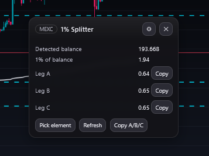

<p align="center">
    
</p>

<h1 align="center">MEXC Balance Splitter</h1>

<p align="center">
    <i>Risk management is the key.</i>
</p>

## ✨ Features

- 📊 **Parse balance directly from the DOM** — no need for API keys.  
- 🧮 **Auto calculation**: 1% of balance → split into 3 equal legs.  
- 📋 **Copy buttons**: one-click copy for each leg or all three as JSON.  
- ⚙️ **Configurable**: pick any element with *Available Balance* via selector.  
- 🔢 **Rounding**: choose decimal precision.  
- 🪄 **Drag-and-drop overlay**: small widget floats above the MEXC UI.  
- 💻 **Optional Python Native Host**: provides high-precision calculations using `Decimal`. (Fallback to JavaScript is built-in.)

## 🔒 Privacy
- ✅ No data collection.
- ✅ No external requests.
- ✅ Settings (selector, decimals, panel position) are stored locally in `storage.local`.

## 🐈‍⬛ TODO

- [x] Google Chrome & Opera Support
- [ ] Adjustable percentage
- [ ] Adjustable amount of 'steps/legs'
- [ ] Auto-paste
- [ ] Better balance detection
- [ ] Multiple platforms support (Weex, BingX, Bybit)

## 🚀 Quick Start

### Development build (temporary add-on)

1. Clone this repo:
   ```bash
   git clone https://github.com/worldspawn-web/mexc_balance_splitter.git
   cd mexc_balance_splitter
   ```
2. Open Firefox → `about:debugging#/runtime/this-firefox.`
3. Click `Load Temporary Add-on...` and select `extension/manifest.json`.
4. Go to MEXC Futures, open the widget (top-left), click Pick element, and select your balance element.
5. PROFIT?!

## 🖥️ Native Host (optional)

For exact `Decimal` math, install the Python Native Host:

- Windows: run `native/install_windows.bat`.

- Linux/macOS: copy `native/mexc.balance.calculator.json` into your system’s native-messaging folder and point `path` to `python3 -u host.py`.

Without it, the extension still works using JavaScript fallback.
